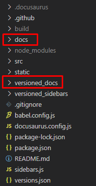
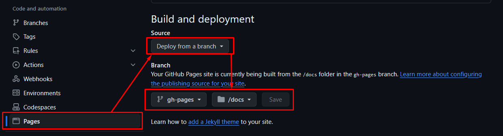

# Maintainer Guide

This project uses [Docusaurus](https://docusaurus.io/) to generate a static website, which is deployed using [GitHub Pages](https://pages.github.com/). We use [GitHub Actions]() to handle automatic deployment when changes are detected on relevant branches.

This guide describes the directory structure for the project, deployment configuration and process, branch structure, and settings for GitHub Pages. This guide is meant to facilitate both skimming and sequential reading.

Header quick links:
- [Directory Structure](#Directory-structure)
- [Site versioning](#Site-versioning)
- [Dev and Main deployment](#Dev-and-Main-deployment)
- [Local deployment testing](#Local-deployment-testing)
- [GitHub Actions](#GitHub-Actions)
- [GitHub Pages](#GitHub-Pages)

## Directory structure

The directory structure for this project is based on the [Docusaurus Tutorial Project's](https://tutorial.docusaurus.io/)  directory structure.
- Most of the OpenDI-relevant content resides in the `docs` and `versioned_docs` directories.  
- `src/` and `static/` contain source code and static site content, respectively.  
- `docusaurus.config.js` contains the primary configuration settings for the project.  
- `sidebars.js` and `versioned_sidebars/` contain navigation sidebar definitions (for the sidebar on the left side of each page).  
- `versions.json` defines the list of versions.
- `.docusaurus/` and `node_modules/` are generated during the process of [installing Docusaurus for local testing](#Local Deployment Testing). Similarly, `build/` holds local build files as raw static site content.
- `package-lock.json` and `package.json` define the [npm](https://www.npmjs.com/) environment for Pages deployment and local building.

## Site versioning

Some of the contents on the site use Docusaurus's built-in [versioning features](https://docusaurus.io/docs/versioning). Specifically, `sidebars.js` and everything in `docs/` has versioned counterparts, in `versioned_sidebars/` and `versioned_docs/`. `versions.json` lists recognized versions.

To create a new release version, follow the [Tagging a new version](https://docusaurus.io/docs/versioning#tagging-a-new-version) instructions from Docusaurus. This pages contains a quick helpful explanation of what it means to create a new docs version. Everything not mentioned in the explanation given there cannot be versioned.

Most importantly, this includes all content in `src/` and `static/`. **Any content placed in these directories will only have one global version.** Take caution when versioned content references or relies on anything non-versioned. Images and other traditionally-static files can often be placed in the versioned docs directories without sacrificing much functionality.

### Updating an existing version

Since all versions are just copies of the contents in `docs/` and `sidebars.js`, updating a deployed version requires updating that version's files within `versioned_docs/` and `versioned_sidebars.js`.

This may be done by first editing the contents of `docs/` and `sidebars.js`, then overwriting the contents in the versioned docs folder. This way, changes can be first previewed from `docs/` by pushing these changes to `dev` (see [versions](#versions) below). Alternatively, changes can be applied directly to the contents in `versioned_docs/`, and previewed locally first (see [Local deployment testing](#Local deployment testing) below).

### Versions

Currently, there are two primary versions, `Live` and `Next`.
- `Live` is the latest "released" version, and should always remain stable.
- `Next` is a preview of upcoming changes on `dev`, intended for testing, not guaranteed to be stable.

## Dev and Main deployment

To help automate deployment with the versions listed above, this project is configured to selectively deploy some content from `main` and some from `dev`. 

From `dev`, deployment pulls `docs` and `sidebars.js`. These make up the `Next` version on the site.

From `main`, deployment pulls **everything else**. This includes all released versioned docs, all files in `static/` and `src/`, all site configuration in `docusaurus.config.js`, etc.

## Local deployment testing

The site can easily be tested locally, using Docusaurus's premade npm commands and package configuration.

- Ensure you have npm installed. Check [this guide](https://docs.npmjs.com/downloading-and-installing-node-js-and-npm).
- Clone the repository for the site you wish to test locally.
- From the local repo's base directory, run `npm ci` to install node packages.
- Once complete, use `npm run start`. The site will build and deploy locally, with http://localhost:3000/ filling in as the site's main domain.

### Limitations

The overall website is deployed as multiple separate but inter-linked individual sites, and the above method will only locally deploy one of the individual sites. Further, links in the source content for the use URLs that point to the deployed versions of the other sites.

It may be technically possible to test a local deployment of all of the individual sites at once, but the above method does not accomplish this. When testing, keep in mind that links may not behave as expected until the site is deployed. Take extra care to ensure they are pointing where intended, so that they do work once deployed.

## GitHub Actions

This project deploys automatically, using GitHub Actions. To accomplish the split described in [Dev and Main deployment](#Dev-and-Main-deployment), deployment occurs in 4 stages:

- Test Build
- Update Staging Branch
- Build for Deployment
- Deploy Build

The following sections describe the branches involved in the deployment process, and the above 4 stages, in further detail.
### Branches

4 branches are involved in the deployment process:
- `main`
	- Holds production-ready content which has been tested and approved via the Pull Request process. **All GitHub Actions assume that `main` is the default branch.**
- `dev`
	- Holds upcoming changes planned for `main` in the future. Content in `docs/` and `sidebars.js` that successfully builds will deploy to the public site, in the `Next` version.
- `deployment-staging`
	- Staging branch. Combines the production-ready content from `main` with the successfully-built content from `docs/` and `sidebars.js` in `dev`.
- `gh-pages`
	- Holds final built files from `deployment-staging`, for direct deployment to GitHub Pages.
	- The directory structure of this branch is unrelated to that of the other branches. It contains one top-level `docs/` directory that holds the static website files generated by Docusaurus.

### Test Build

The following GitHub Actions handle this stage:
- `test-build-main.yml`
- `test-build-dev.yml`

Each action triggers on detecting changes to the relevant branch. For `dev`, changes to `docs/` or `sidebars.js` trigger a test build. For `main`, **any** change triggers a build. This is to cover unforeseen directory changes, though it means some unnecessary test builds may occur.

These actions can also be triggered manually from the GitHub Actions page in the repo. When manually triggering, make sure to select the appropriate branch.

This stage is intended as a quick sanity check before moving on to the other stages. The triggered action attempts to build the Docusaurus site from the source files on whichever branch changed. If a build fails here, the deployment process ends.

### Update Staging Branch

The following GitHub Action handles this stage:
- `update-staging.yml`

This action triggers when either `test-build-main.yml` or `test-build-dev.yml` completes their run.  The action will only run if the test build was successful. Otherwise, the run is skipped.

This action can also be triggered manually from the GitHub Actions page in the repo. When manually triggering, leaving the `main` branch selected should be fine.

This stage propagates changes from `main` and `dev` into the `deployment-staging` branch, to facilitate [versioning](#Versions). `update-staging.yml` accomplishes this by switching to `deployment-staging`, then selectively checking out portions of `main` and `dev` using [pathspecs](https://css-tricks.com/git-pathspecs-and-how-to-use-them/).

From `dev`, the action pulls everything from `docs/` (pathspec `":docs/*"`), and `sidebars.js` (pathspec `":sidebars.js"`).

From `main`, the action pulls everything else, using pathspec [exclusions](https://git-scm.com/docs/gitglossary#Documentation/gitglossary.txt-exclude). Those pathspecs are `":!docs/*"` and `":!sidebars.js"`.

### Build for Deployment

The following GitHub Action handles this stage:
- `build-for-deployment.yml`

This action triggers when `update-staging.yml` completes its run. The action will only run if the staging branch update was successful. Otherwise, the run is skipped. Most commonly, this occurs when `update-staging.yml` fails to commit because no files changed from the previous commit.

This stage essentially runs the instructions from the [Local deployment testing](#Local-deployment-testing) section above automatically, and places the resulting build files into the `gh-staging` branch. More specifically, it:
- Switches to `deployment-staging` and sets up npm.
- Uses `npm run build` to generate build files, stored in their default `build/` directory
	- This directory is in the .gitignore, so next these files are copied out of the repo to a temporary directory, to preserve them when switching branches.
- Switches to `gh-pages` and copies the contents of the temporary directory into a top-level directory called `docs/`, after clearing out the previous run's contents entirely.
- Pushes these new contents to trigger the next stage.

Sometimes this action will fail for reasons similar to `update-staging.yml`'s most common failure mentioned above. For instance, if files are pushed to `main` that do not change the outcome of a Docusaurus build, `test-build-main.yml` may succeed, triggering `update-staging.yml`, which will propagate those files to the `deployment-staging` branch. In this case, `build-for-deployment.yml` will run, building the files. However, since the new files did not change the build outcome, the build files will be identical to the previous run, and the commit to `gh-pages` will fail. This is likely not a problematic failure!

### Deploy Build

This stage is handled entirely by built-in automatic GitHub Actions. No maintenance is required for this stage. It is triggered automatically whenever the contents of the `docs/` directory in the `gh-pages` branch change. It deploys the build artifacts therein to a static GitHub Pages site. See below for settings configurations that allow this.

## GitHub Pages

GitHub Pages is set to deploy from the `gh-pages` branch. This branch is expected to contain build files generated by Docusaurus during the above [build](#Update-Staging-Branch) process, inside a top-level directory called `docs/`.

GitHub Pages settings should be configured like this:  

### Why deploy from a branch?

**It is necessary to deploy from a branch, rather than from a GitHub Actions workflow directly!** This is because GitHub Actions cannot be configured so that they both
- trigger automatically from pushes to or actions originating from `branch X`, AND
- always run on `branch Y` regardless of the above

To deploy from Actions directly, the [Build for Deployment](#Build-for-Deployment) stage would need to be able to run on the `deployment-staging` branch, since the `actions/deploy-pages@v4` action suggested [here](https://docusaurus.io/docs/deployment#triggering-deployment-with-github-actions) requires that the deployment call originate from the source branch containing your build files (see item 4 [here](https://github.com/actions/deploy-pages?tab=readme-ov-file#security-considerations)). However, the actions for the [Test Build](#Test-Build) stage must be triggered by changes to `dev` and `main` respectively.

Thus, in order to deploy form an Action, the Build for Deployment action must
- trigger automatically from actions originating from `dev` or `main`, AND
- always run on `deployment-staging` regardless of trigger source

It is not enough to `git switch` to the `deployment-staging` branch before building and calling on `actions/deploy-pages@v4`. This does create the `build/` files in `deployment-staging` as desired, but `actions/deploy-pages@v4` still checks for build files in the branch from which the action was originally triggered. `git switch` has no effect on this.
