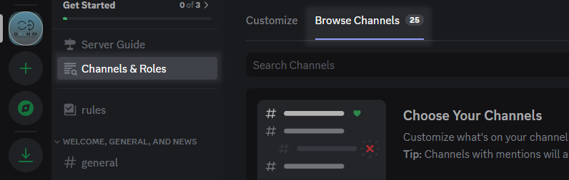
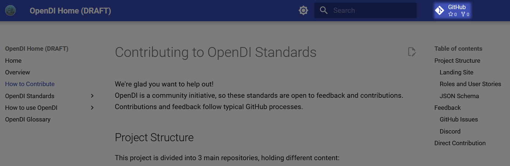
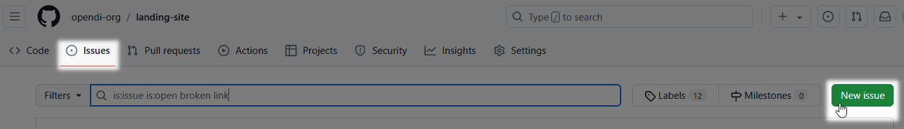
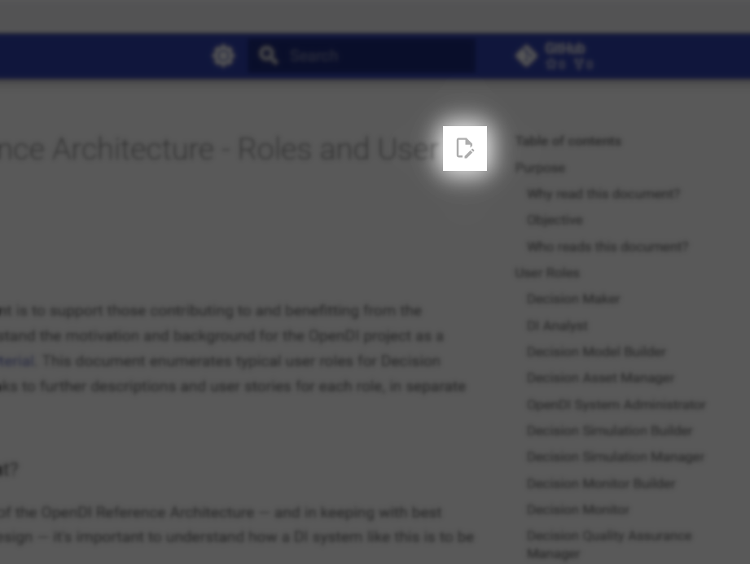

# Contributing to OpenDI Standards

We're glad you want to help out!  
OpenDI is a community initiative, so these standards are open to feedback and contributions.  Contributions and feedback follow typical GitHub processes.

## Project Structure

This project is divided into 3 main repositories, holding different content:

### Landing Site

Holds the source content for the main OpenDI landing pages, including introductory and cross-document resources like this contribution guide.

[View Repo >>](https://github.com/opendi-org/landing-site)

### Roles and User Stories

Holds source content describing Roles for a DI team, and the user stories for each role.

[View Repo >>](https://github.com/opendi-org/roles-user-stories)

### JSON Schema

Holds the OpenDI JSON Schema for Causal Decision Models, and source for the schema's documentation.

[View Repo >>](https://github.com/opendi-org/json-schema)

## Feedback

We use two main channels for feedback submission:

- GitHub Issues
- OpenDI Discord Server

Follow GitHub best practices for [submitting issues](https://docs.github.com/en/get-started/exploring-projects-on-github/finding-ways-to-contribute-to-open-source-on-github#opening-an-issue) and for [contributing via forks and pull requests](https://docs.github.com/en/get-started/exploring-projects-on-github/contributing-to-a-project). The sections below provide additional detail for these processes.

### Discord
The OpenDI Discord Server is best for providing general feedback about the standards and documentation, or about the OpenDI initiative as a whole. You can also join in ongoing conversations with experts across many fields relevant to Decision Intelligence!

<iframe src="https://discord.com/widget?id=1208154608984129557&theme=dark" width="350" height="500" allowtransparency="true" frameborder="0" sandbox="allow-popups allow-popups-to-escape-sandbox allow-same-origin allow-scripts"></iframe>

To access the Discord channels for these OpenDI materials:

1. Select the "I would like to contribute to OpenDI standards" option in the initial join question.
    
2. Read and accept the server rules, by clicking "Finish".
3. Look for the Ecosystem Resources channel category in your channel list
      
    If you do not see the channel category, check the "Browse Channels" option in the "Channels and Roles" page, at the top of the channel list.  
    

### GitHub Issues
GitHub Issues are best for providing actionable feedback about individual repositories, including:

- bug reports
- requests for new features or additions
- suggestions for alterations or specific constructive criticism
- etc

> New to GitHub Issues? Check the official GitHub docs:  
> [Creating an issue](https://docs.github.com/en/issues/tracking-your-work-with-issues/creating-an-issue)  

To submit an issue,

1. Navigate to the **Issues** page of the relevant repository.  
    Links to each repository can be found above, but the easiest way to find the correct repository to use when providing feedback about a specific OpenDI webpage is to use the GitHub link in the top-right corner of each page.

    **Use the GitHub link to easily access the GitHub repository associated with each page**
      

2. Use the **issue search feature** to see if your issue/report/suggestion already exists.  
    If your issue already exists, feel free to add additional discussion in the comments section for the existing issue.

    **Search to see if your issue already exists**
    

3. If no relevant issue exists, **submit a new issue**.

    **Use the New Issue button to create an issue**
    

    Follow these basic issue guidelines:
    > 1. Use a **succinct title**.
    > 2. Be **descriptive and direct** in your issue description.
    > 3. Submit your issue to the most **relevant repository**.  
    > Issues that must be moved after posting will take longer to process.
    > 4. Use an approprate **issue template**.  
    > Blank-template issues will be unlabeled, and will take longer to process.

    **Select an issue template to get started**
    

## Direct Contribution

Direct contributions are welcome! Contributions should follow the standard [fork](https://docs.github.com/en/pull-requests/collaborating-with-pull-requests/working-with-forks/fork-a-repo) and [pull request](https://docs.github.com/en/pull-requests/collaborating-with-pull-requests/proposing-changes-to-your-work-with-pull-requests/creating-a-pull-request-from-a-fork) workflow. Forks should use `dev` as their target working branch.

To simplify this process, the website provides direct links to edit each page in the GitHub web client.

**Use the Edit Page link to access the GitHub web client and edit the source for the current page.**
  